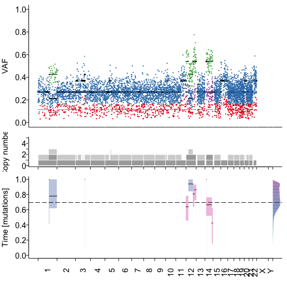

MutationTimeR
=============

MutationTimeR is an R package to time somatic mutations relative to
clonal and subclonal copy number states and calculate the relative
timing of copy number gains. It has been used by the PCAWG consortium to
calculate mutation times of 2,778 whole genome sequencing samples.
Please see M. Gerstung, C. Jolly, I. Leshchiner, S. Dentro, S. Gonzalez
*et al.*, [The Evolutionary History of 2,658
Cancers](https://doi.org/10.1038/s41586-019-1907-7), *Nature*. *578*,
pages 122-128(2020).

Installation
------------

MutationTimeR runs in most current `R` versions. You can install and
load MutationTimeR using

    devtools::install_github("mg14/mg14")
    devtools::install_github("gerstung-lab/MutationTimeR")

Running MutationTimeR
---------------------

MutationTimeR requires a `vcf` object containing point mutations (SNVs,
MNVs, or indels) and a `GRanges` object with the copy number segments of
the sample.

    library("MutationTimeR")
    #vcf <- readVcf("myvcf.vcf") # Point mutations, needs `info` columns t_alt_count t_ref_count
    #bb <- GRanges(, major_cn= , minor_cn=, clonal_frequency=purity) # Copy number segments, needs columns  major_cn, minor_cn and clonal_frequency of each segment
    #clusters <- data.frame(cluster= , n_ssms=, proportion=) # Optional data.frame with subclonal cluster locations (VAF proportion) and size (number of variants n_ssms)
    data(MutationTimeR)

To run MutationTimeR simply use

    mt <- mutationTime(vcf, bb, clusters=clusters, n.boot=10)

Annotation of point mutations
-----------------------------

MutationTimer produces two main outputs. The first is the probability
for each individual point mutation from the original `vcf` object to
belong to different copy number levels:

    head(mt$V)

    ## DataFrame with 6 rows and 15 columns
    ##       MutCN MutDeltaCN     MajCN     MinCN  MajDerCN  MinDerCN       CNF
    ##   <numeric>  <numeric> <numeric> <numeric> <numeric> <numeric> <numeric>
    ## 1         1          0         1         1         1         1      0.54
    ## 2         1          0         1         1         1         1      0.54
    ## 3         1          0         1         1         1         1      0.54
    ## 4         1          0         1         1         1         1      0.54
    ## 5         1          0         1         1         1         1      0.54
    ## 6         1          0         1         1         1         1      0.23
    ##            CNID            pMutCN     pGain              pSingle
    ##   <IntegerList>         <numeric> <numeric>            <numeric>
    ## 1             1 0.999999992268111         0    0.999999992268111
    ## 2             1   0.9999753674765         0      0.9999753674765
    ## 3             1 0.999937495120266         0    0.999937495120266
    ## 4             1 0.999999348396561         0    0.999999348396561
    ## 5             1 0.999999960786733         0    0.999999960786733
    ## 6             1 0.999795151536058         0 0.000204848463942198
    ##                   pSub pAllSubclones         pMutCNTail         CLS
    ##              <numeric>        <List>          <numeric>    <factor>
    ## 1 7.73188863470227e-09                0.976558542742796 clonal [NA]
    ## 2 2.46325235003678e-05                0.653374217923694 clonal [NA]
    ## 3  6.2504879733583e-05                0.336557312762548 clonal [NA]
    ## 4 6.51603439202351e-07                0.926037697462508 clonal [NA]
    ## 5 3.92132672843943e-08                0.940677539480767 clonal [NA]
    ## 6    0.999795151536058               0.0814516989630261   subclonal

These can be converted into basic clonal states
(`early clonal/late clonal/clonal/subclonal/NA`)

    table(mt$V$CLS)

    ## 
    ## clonal [early]  clonal [late]    clonal [NA]      subclonal 
    ##            198             95           4354            852

Add this annotation to the vcf

    info(header(vcf)) <- rbind(info(header(vcf)),mtHeader())
    info(vcf) <- cbind(info(vcf), mt$V)

Timing of copy number gains
---------------------------

The proportion of point mutations in different copy number states, in
turn, defines the molecular timing of gains. This can be calculated
using:

    mcols(bb) <- cbind(mcols(bb),mt$T)
    plotSample(vcf,bb)

